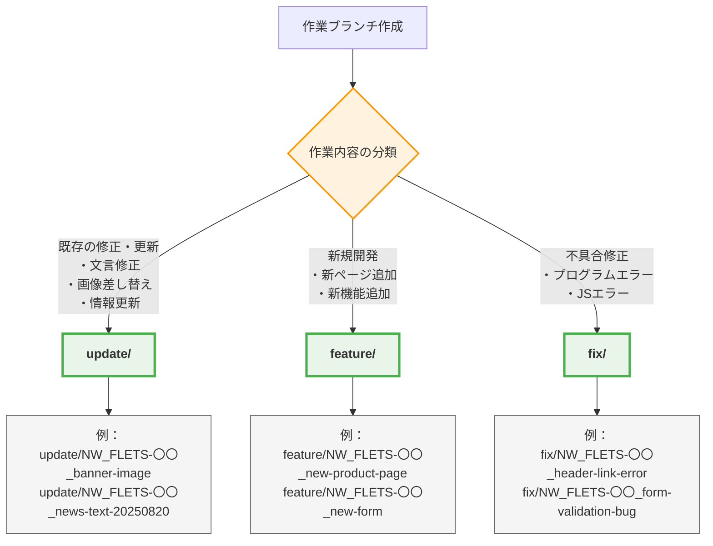

# イメージ図
 

リポジトリ運用ルールは[こちら](./README.md)

## 目次
- [作業の流れ](#flow)
- [ブランチ命名規則イメージ](#name)
 
 

---

## 作業の流れ

```mermaid
flowchart TD
    START[作業開始] --> INIT{初回クローン？}

    INIT -->|Yes| CLONE[git clone --filter=blob:none --sparse &lt;REPO_URL&gt;<br/>cd &lt;REPO_DIR&gt;]
    CLONE --> SPARSE{取得単位を選択}
    SPARSE -->|ディレクトリ| SP_DIR[ディレクトリ単位（初期化）<br/>git sparse-checkout init --cone<br/>git sparse-checkout set user]
    SPARSE -->|ファイル（例）| SP_FILE[ファイル単位（例）<br/>git sparse-checkout set --no-cone<br/>/user/index.html /user/confirm/index.html /user/**/*.css]
    SP_DIR --> DEVUP
    SP_FILE --> DEVUP

    INIT -->|No| DEVUP[git pull origin dev]
    DEVUP --> CONFLICT{コンフリクト発生？}

    CONFLICT -->|Yes| REPORT[チームに即座に報告]
    CONFLICT -->|No| BRANCH[作業ブランチ作成<br/>git checkout -b update/xxx]

    REPORT --> ANALYZE[コンフリクト原因分析]
    ANALYZE --> COLLABORATE[他メンバーと協力して解決]
    COLLABORATE --> RESOLVE[コンフリクト解決]
    RESOLVE --> CHECKMARK[マークアップ残存確認]
    CHECKMARK --> TEST[動作確認・テスト]
    TEST --> BRANCH

    BRANCH --> WORK[ファイル編集・修正作業]
    WORK --> STATUS[git status で変更内容確認]
    STATUS --> DANGER{危険な状態？}

    DANGER -->|意図しないファイルあり| RESET[git reset で取り消し]
    DANGER -->|設定ファイル混入| GITIGNORE[.gitignore 見直し]
    DANGER -->|No| ADD[git add .]

    RESET --> STATUS
    GITIGNORE --> STATUS
    ADD --> COMMIT[git commit -m &quot;作業内容（例）&quot;]
    COMMIT --> PUSH[git push origin branch]

    PUSH --> PREXIST{PRは既に存在？}
    PREXIST -->|No 初回| CREATEPR[Pull Request 作成]
    PREXIST -->|Yes 修正中| AUTOUPDATE[既存PRに自動反映]

    CREATEPR --> REVIEW[レビュー依頼]
    AUTOUPDATE --> REVIEW

    REVIEW --> REVIEWRESULT{レビュー結果}
    REVIEWRESULT -->|修正要求| FIXNOTE[修正要求対応<br/>PRは取り下げない]
    REVIEWRESULT -->|承認| MERGE[Squash and merge でdev統合]

    FIXNOTE --> WORK
    MERGE --> CLEANUP[作業ブランチ削除]
    CLEANUP --> WORKEND[個人作業完了]

    %% リリースの流れ
    WORKEND --> RELEASE_READY{リリース準備完了？}
    RELEASE_READY -->|まだ| WORKEND
    RELEASE_READY -->|Yes| RELEASE_PR[dev → main のPR作成<br/>責任者がレビュー・承認]

    RELEASE_PR --> RELEASE_MERGE[Squash and merge で本番反映]
    RELEASE_MERGE --> FTP_UPLOAD[main を手動FTPでサブ環境確認]
    FTP_UPLOAD --> PROD_OK{本番反映OK？}

    PROD_OK -->|問題あり| HOTFIX[緊急修正対応]
    PROD_OK -->|OK| SYNC_PR[★リリース後同期作業★<br/>本番反映後の開発ブランチ同期]

    HOTFIX --> FTP_UPLOAD
    SYNC_PR --> SYNC_CREATE[GitHub で PR作成<br/>base: dev, compare: main<br/>Merge commit で統合（Squash不可）]
    SYNC_CREATE --> LOCAL_UPDATE[各自ローカル最新化<br/>git fetch origin --prune<br/>git switch main && git pull origin main<br/>git switch dev && git pull origin dev]
    LOCAL_UPDATE --> END[運用サイクル完了]

    %% スタイル定義
    style REPORT fill:#ffebee,stroke:#f44336,stroke-width:2px
    style COLLABORATE fill:#e8f5e8,stroke:#4caf50,stroke-width:2px
    style FIXNOTE fill:#e3f2fd,stroke:#1976d2,stroke-width:2px
    style DANGER fill:#fff3e0,stroke:#ff9800,stroke-width:2px
    style SYNC_PR fill:#f3e5f5,stroke:#9c27b0,stroke-width:3px
    style RELEASE_PR fill:#e1f5fe,stroke:#0288d1,stroke-width:2px
    style LOCAL_UPDATE fill:#e8f5e8,stroke:#4caf50,stroke-width:2px
```
---

## ブランチ命名規則イメージ

```mermaid
flowchart TD
    START[作業ブランチ作成] --> WORK{作業内容の分類}
    
    WORK -->|既存の修正・更新<br/>・文言修正<br/>・画像差し替え<br/>・情報更新| UPDATE
    WORK -->|新規開発<br/>・新ページ追加<br/>・新機能追加| FEATURE
    WORK -->|不具合修正<br/>・プログラムエラー<br/>・JSエラー| FIX
    
    UPDATE[update/]
    FEATURE[feature/]  
    FIX[fix/]
    
    UPDATE --> UPDATE_EX[例：<br/>update/NW_FLETS-〇〇_banner-image<br/>update/NW_FLETS-〇〇_news-text-20250820]
    FEATURE --> FEATURE_EX[例：<br/>feature/NW_FLETS-〇〇_new-product-page<br/>feature/NW_FLETS-〇〇_new-form]
    FIX --> FIX_EX[例：<br/>fix/NW_FLETS-〇〇_header-link-error<br/>fix/NW_FLETS-〇〇_form-validation-bug]
    
    classDef prefix fill:#e8f5e8,stroke:#4caf50,stroke-width:3px,font-weight:bold
    classDef example fill:#f5f5f5,stroke:#666,stroke-width:1px
    classDef decision fill:#fff3e0,stroke:#ff9800,stroke-width:2px
    
    class UPDATE,FEATURE,FIX prefix
    class UPDATE_EX,FEATURE_EX,FIX_EX example
    class WORK decision
```
