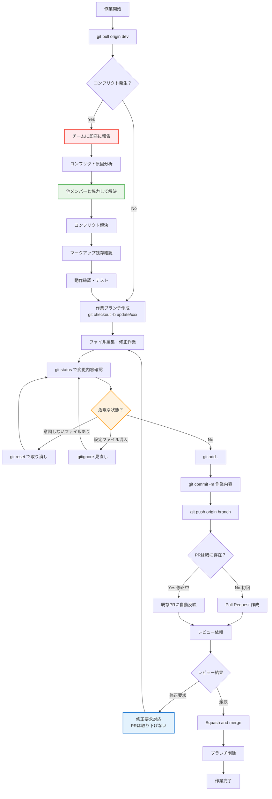

```mermaid
flowchart TD
START[作業開始] --> PULL[git pull origin dev]
PULL --> CONFLICT{コンフリクト発生？}

    CONFLICT -->|Yes| REPORT[チームに即座に報告]
    CONFLICT -->|No| BRANCH[作業ブランチ作成<br/>git checkout -b update/xxx]

    REPORT --> ANALYZE[コンフリクト原因分析]
    ANALYZE --> COLLABORATE[他メンバーと協力して解決]
    COLLABORATE --> RESOLVE[コンフリクト解決]
    RESOLVE --> CHECKMARK[マークアップ残存確認]
    CHECKMARK --> TEST[動作確認・テスト]
    TEST --> BRANCH

    BRANCH --> WORK[ファイル編集・修正作業]
    WORK --> STATUS[git status で変更内容確認]
    STATUS --> DANGER{危険な状態？}

    DANGER -->|意図しないファイルあり| RESET[git reset で取り消し]
    DANGER -->|設定ファイル混入| GITIGNORE[.gitignore 見直し]
    DANGER -->|No| ADD[git add .]

    RESET --> STATUS
    GITIGNORE --> STATUS
    ADD --> COMMIT[git commit -m 作業内容]
    COMMIT --> PUSH[git push origin branch]

    PUSH --> PREXIST{PRは既に存在？}
    PREXIST -->|No 初回| CREATEPR[Pull Request 作成]
    PREXIST -->|Yes 修正中| AUTOUPDATE[既存PRに自動反映]

    CREATEPR --> REVIEW[レビュー依頼]
    AUTOUPDATE --> REVIEW

    REVIEW --> REVIEWRESULT{レビュー結果}
    REVIEWRESULT -->|修正要求| FIXNOTE[修正要求対応<br/>PRは取り下げない]
    REVIEWRESULT -->|承認| MERGE[Squash and merge]

    FIXNOTE --> WORK
    MERGE --> CLEANUP[ブランチ削除]
    CLEANUP --> END[作業完了]

    style REPORT fill:#ffebee,stroke:#f44336,stroke-width:2px
    style COLLABORATE fill:#e8f5e8,stroke:#4caf50,stroke-width:2px
    style FIXNOTE fill:#e3f2fd,stroke:#1976d2,stroke-width:2px
    style DANGER fill:#fff3e0,stroke:#ff9800,stroke-width:2px

```
